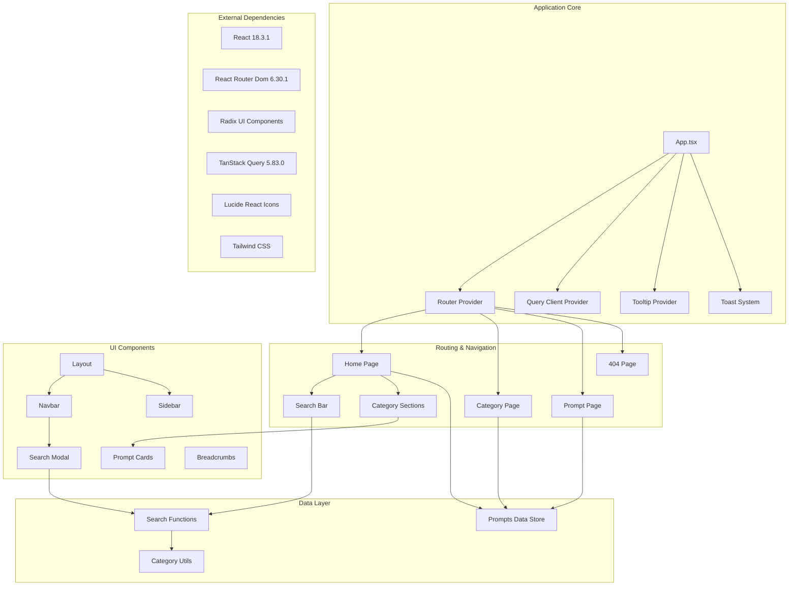

# Dependency Upgrade Plan

## Application Architecture Overview

## Current Dependency Analysis

### Critical Security & EOL Issues Identified

#### 🚨 High Priority (Security & EOL)
1. **React 18.3.1** → **React 19.x** (Current: 19.1.0)
   - **Status**: End-of-Life (No security updates)
   - **Risk**: High - No security patches for React 18.x
   - **Impact**: Core framework - affects entire application

2. **React Router Dom 6.30.1** → **Latest 6.x** (Target: 6.31.x)
   - **Status**: Known vulnerability CVE-2024-45296 (path-to-regexp)
   - **Risk**: High - Data spoofing vulnerability
   - **Impact**: Navigation and routing security

#### ⚠️ Medium Priority (Compatibility & Features)
3. **Radix UI Components** → **Latest React 19 Compatible**
   - **Status**: Compatibility issues with React 19 (GitHub Issue #3295)
   - **Risk**: Medium - UI components may break
   - **Impact**: All UI components and interactions

4. **TanStack Query 5.83.0** → **Latest 5.x** (Target: 5.85.5+)
   - **Status**: Compatible with React 19
   - **Risk**: Low - Good compatibility track record
   - **Impact**: Data fetching and caching

#### 🔄 Low Priority (Minor Updates)
5. **TypeScript & Build Tools** → **Latest stable**
6. **Tailwind CSS & Class Variance Authority** → **Latest stable**
7. **Lucide React Icons** → **Latest stable**

## Upgrade Plan

### Phase 1: Pre-Upgrade Preparation
**Duration**: 1-2 hours
**Risk Level**: Low

- [ ] Create comprehensive backup of current working state
- [ ] Document current visual state with screenshots of all pages
- [ ] Test all current functionality and document expected behaviors
- [ ] Set up automated testing baseline (if not already present)
- [ ] Create rollback strategy documentation

### Phase 2: React Router Security Fix
**Duration**: 1-2 hours  
**Risk Level**: Medium
**Priority**: IMMEDIATE (Security vulnerability)

- [ ] **Upgrade React Router Dom**
  - [ ] Update `react-router-dom` to latest 6.x version (6.31.x+)
  - [ ] Update related dependencies (`@types/react-router-dom` if used)
  - [ ] Test all routing functionality:
    - [ ] Home page navigation
    - [ ] Category page routing with parameters
    - [ ] Subcategory routing
    - [ ] Prompt page routing
    - [ ] 404 page handling
    - [ ] Browser back/forward navigation
    - [ ] Search modal navigation
- [ ] **Verify UI Consistency**
  - [ ] Check navbar layout and functionality
  - [ ] Verify breadcrumbs display correctly
  - [ ] Test sidebar navigation
  - [ ] Ensure search modal routing works
- [ ] **Test Search Functionality**
  - [ ] Navbar search modal
  - [ ] Hero section search bar
  - [ ] Search result navigation

### Phase 3: TanStack Query Update (Low Risk)
**Duration**: 30 minutes
**Risk Level**: Low

- [ ] **Update TanStack Query**
  - [ ] Update `@tanstack/react-query` to 5.85.5+
  - [ ] Test query client functionality
  - [ ] Verify no breaking changes in query patterns (current app doesn't use complex queries)
- [ ] **Verify Application State**
  - [ ] Check that toasts and notifications work
  - [ ] Verify tooltip provider functionality

### Phase 4: React 19 Upgrade (High Impact)
**Duration**: 4-6 hours
**Risk Level**: High
**Prerequisites**: Complete Phases 1-3 successfully

- [ ] **Pre-React 19 Compatibility Check**
  - [ ] Research current Radix UI React 19 compatibility status
  - [ ] Check if compatibility issues in GitHub issue #3295 are resolved
  - [ ] Test Radix UI components in isolation if possible

- [ ] **React 19 Core Update**
  - [ ] Update `react` to 19.1.0+
  - [ ] Update `react-dom` to matching version
  - [ ] Update `@types/react` and `@types/react-dom` to compatible versions
  - [ ] Address any TypeScript compilation errors

- [ ] **Post-React 19 Compatibility Fixes**
  - [ ] Test all UI components functionality:
    - [ ] Buttons and interactive elements
    - [ ] Modal dialogs (search modal)
    - [ ] Dropdown menus and popovers
    - [ ] Sidebar collapsible functionality
    - [ ] Toast notifications
    - [ ] Tooltips
  - [ ] **Critical UI Testing Checklist**:
    - [ ] Homepage layout integrity
    - [ ] Category page grid layouts
    - [ ] Prompt card rendering
    - [ ] Search functionality (both hero and navbar)
    - [ ] Navigation breadcrumbs
    - [ ] Responsive design on mobile/tablet
    - [ ] Dark mode compatibility (if implemented)

- [ ] **Address Radix UI Issues** (if compatibility problems persist)
  - [ ] Check for Radix UI React 19 compatible releases
  - [ ] Consider temporary workarounds or component replacements if needed
  - [ ] Document any temporary fixes for future updates

### Phase 5: Final Polish & Minor Updates
**Duration**: 1-2 hours
**Risk Level**: Low

- [ ] **Update Remaining Dependencies**
  - [ ] Update TypeScript to latest stable
  - [ ] Update Vite to latest stable 
  - [ ] Update Tailwind CSS to latest stable
  - [ ] Update `class-variance-authority` to latest
  - [ ] Update `lucide-react` to latest
  - [ ] Update ESLint and other dev dependencies

- [ ] **Final Quality Assurance**
  - [ ] Complete visual regression testing
  - [ ] Test all interactive elements
  - [ ] Verify search performance
  - [ ] Check console for any warnings or errors
  - [ ] Test on different browsers (Chrome, Firefox, Safari, Edge)
  - [ ] Test responsive design across breakpoints
  - [ ] Verify build process and optimization

### Phase 6: Performance & Security Validation
**Duration**: 1 hour
**Risk Level**: Low

- [ ] **Performance Checks**
  - [ ] Bundle size analysis (should be similar or smaller)
  - [ ] Page load time validation
  - [ ] Search responsiveness testing
  - [ ] Memory usage verification

- [ ] **Security Validation**
  - [ ] Run security audit on updated dependencies
  - [ ] Verify no new security warnings
  - [ ] Test for any potential XSS issues in search functionality

## Rollback Strategy

### Automatic Rollback Triggers
- Any critical functionality breaking (navigation, search, layout)
- Security vulnerabilities introduced
- Performance degradation > 20%
- Build process failures

### Rollback Process
1. **Git Reset**: `git reset --hard <backup-commit-hash>`
2. **Dependency Restore**: `npm ci` (from package-lock.json backup)
3. **Verification**: Test critical paths (search, navigation, UI)
4. **Documentation**: Log issues encountered for future reference

## Success Metrics

### Functionality Metrics
- [ ] All pages load without errors
- [ ] Search functionality works in both locations (hero + navbar)
- [ ] All navigation paths function correctly
- [ ] UI components render properly
- [ ] No console errors or warnings

### Security Metrics
- [ ] No critical security vulnerabilities in dependencies
- [ ] CVE-2024-45296 resolved
- [ ] Security audit passes clean

### Performance Metrics
- [ ] Bundle size remains within 10% of current size
- [ ] Page load times remain comparable
- [ ] Search response time < 100ms

## Risk Assessment Summary

| Phase | Risk Level | Impact | Mitigation |
|-------|------------|---------|------------|
| Phase 1 | Low | None | Backup & documentation |
| Phase 2 | Medium | Route security | Incremental testing |
| Phase 3 | Low | Query functionality | Isolated testing |
| Phase 4 | High | Entire UI | Comprehensive testing, rollback ready |
| Phase 5 | Low | Build process | Standard testing |
| Phase 6 | Low | Performance | Monitoring & validation |

## Notes

- **Critical Path**: Phases 1-2 should be completed immediately due to security vulnerability
- **React 19 Caution**: Phase 4 has highest risk due to potential Radix UI compatibility issues
- **Testing Strategy**: Each phase includes specific UI/functionality verification steps
- **No Feature Changes**: Plan focuses solely on dependency upgrades and security fixes

---

**Plan Created**: September 26, 2025  
**Estimated Total Duration**: 8-12 hours  
**Primary Risk**: Radix UI React 19 compatibility  
**Primary Benefit**: Security vulnerability fixes and modern React features